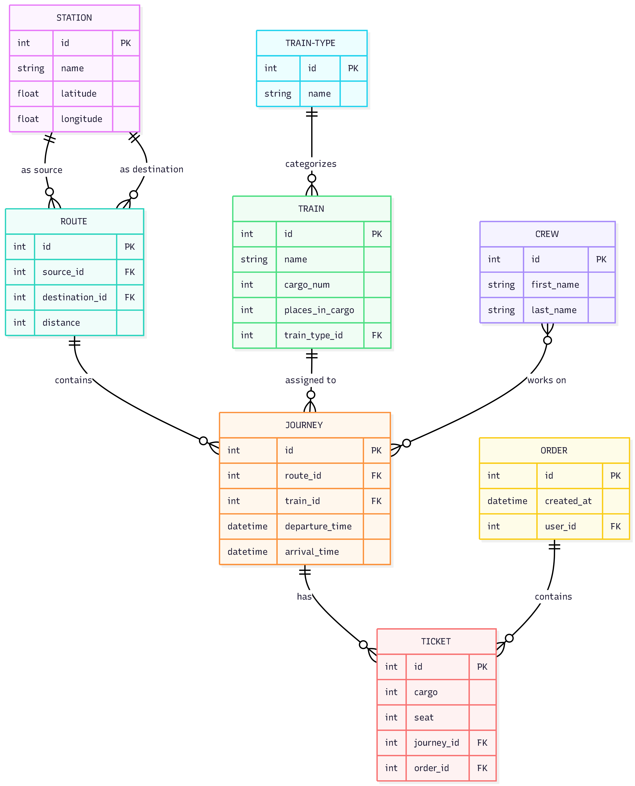

# Train Station API Service

An API service for automating railway station management, trips, crew scheduling, and ticket booking[cite: 1]. The project is built using **Django REST Framework (DRF)**, with PostgreSQL as the
primary database and JWT authentication.

## 🚀 Features

- **JWT Authentication**: Secure access to endpoints using access and refresh tokens.
- **Admin Panel**: Convenient management of logistics, trains, and orders via `/admin/`.
- **Interactive documentation**: The full API specification (Swagger UI) is available at `/api/doc/swagger/`
- **Train and Train Type Management**: Adding trains with specifications for the number of carriages and seats (`Train`, `TrainType`).
- **Управление станциями и маршрутами**: Создание станций с координатами и формирование маршрутов между ними (`Station`, `Route`).
- **Journeys**: Scheduling journeys and assigning the crew, train, and departure/arrival times.

- **Order and Ticket Management**: Capability to book flight tickets with automatic seat availability validation and protection against duplicate bookings (`Order`, `Ticket`). **Flexible filtering**:
  Search for trips by departure/arrival stations, route, and date, as well as filtering trains by type.

- **Access rights management**: Viewing the schedule is available to all users; logistics management is restricted to administrators; and creating orders is available to authorized passengers.

## Project structure

```text
railway_station_api/
│
├── train_station/            # Основний додаток для керування логістикою станції
│   ├── migrations/
│   │   └── __init__.py
│   ├── __init__.py
│   ├── admin.py              # Регистрація моделей в адмін-панелі
│   ├── apps.py
│   ├── models.py             # Моделі: Station, Route, TrainType, Train, Crew,
│   │                         # Journey
│   ├── serializers.py        # DRF Серіалізатори для всіх моделей логістики
│   ├── urls.py               # Ендпоінти додатку train_station
│   └── views.py              # Класові уявлення (Class-Based Views / ViewSets)
│
├── orders/                   # Додаток для керування замовлень та квітками
│   ├── migrations/
│   │   └── __init__.py
│   ├── __init__.py
│   ├── admin.py
│   ├── apps.py
│   ├── models.py             # Моделі: Order, Ticket
│   ├── serializers.py        # Серіалізатори для замовлень для валідаціїї місць
│   ├── urls.py
│   └── views.py              # Эндпоінти для бронування
│
├── user/                     # Додаток для кастомной моделі користувача
│   │                         # та аутентифікації (JWT)
│   ├── migrations/
│   │   └── __init__.py
│   ├── __init__.py
│   ├── admin.py
│   ├── apps.py
│   ├── models.py             # Кастомный User
│   ├── serializers.py        # Серіалізатори для регистрації та профилю
│   ├── urls.py
│   └── views.py
│
├── railway_station_config/   # Корнева папка конфигурация Django проекту
│   ├── __init__.py
│   ├── asgi.py
│   ├── settings.py           # Навлаштування проекту (DRF, JWT, бази даних)
│   ├── urls.py               # Гловний urls.py (роуты податків і Swagger)
│   └── wsg.py
│
├── manage.py
├── requirements.txt          # Залежності проекту
│                             # (django, djangorestframework,
│                             # djangorestframework-simplejwt
│                             # та інші.)
└── README.md
```

## 🛠️ Database Architecture and Structure

The project is divided into isolated Django applications based on areas of responsibility:

- `user` — management of the custom user model (email-based authentication) and user profiles.
- `train_station` — management of stations, routes, trains, crews, and trips.
- `orders` — management of orders and transactional ticket purchasing.

## Data Base structure


